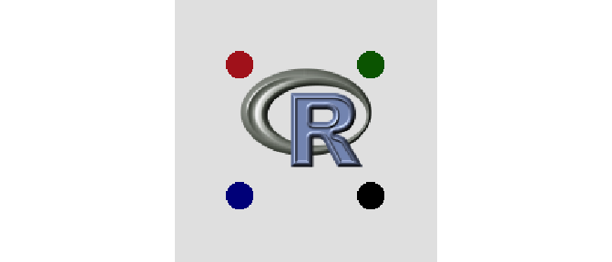
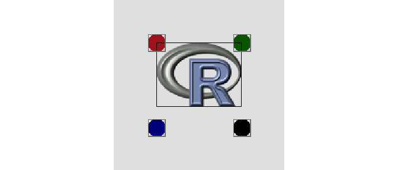

<!-- README.md is generated from README.Rmd. Please edit that file -->

# naracollide

<!-- badges: start -->


[](https://github.com/coolbutuseless/naracollide/actions/workflows/R-CMD-check.yaml)
<!-- badges: end -->

`{naracollide}` is for detecting collisions between native raster
objects

### What’s in the box

- `col_detect_broad()` collision detection between the bounding boxes of
  the native rasters. Fast.
- `col_detect_narrow()` collision detection between overlapping
  non-transparent pixels
- `col_setup()` Setup the collision data structure

## Installation

You can install from
[GitHub](https://github.com/coolbutuseless/naracollide) with:

``` r
# install.packages('remotes')
remotes::install_github('coolbutuseless/nara')
remotes::install_github('coolbutuseless/naracollide')
```

## Collision detection example

Does the R logo intersect with any of the circle targets?

``` r
library(nara)
library(naracollide)

# Setup the screen to draw on
screen <- nr_new(200, 200, 'grey90')

# The R logo as a native raster
logo  <- png::readPNG(system.file("img", "Rlogo.png", package="png"), native = TRUE)
xlogo <- 100
ylogo <-  90

# Set up the 4 circular targets
targets <- lapply(1:4, function(i) {
  target <- nr_new(21, 21, 'transparent')
  nr_circle(target, 10, 10, 10, c('firebrick', 'darkblue', 'darkgreen', 'black')[i])
})

xtargets <- c(50,  50, 150, 150)
ytargets <- c(50, 150,  50, 150)

# Draw the targets
for (i in seq_along(targets)) {
  nr_blit(screen, xtargets[i], ytargets[i], targets[[i]], hjust = 0.5, vjust = 0.5)
}

# Draw the logo
nr_blit(screen, xlogo, ylogo, logo, hjust = 0.5, vjust = 0.5)

# Show the screen
plot(screen, T)
```



``` r
# Setup collision detection
coldf <- col_setup(targets, xtargets, ytargets, hjust = 0.5, vjust = 0.5)

# Check for bounding box intersection
# Two `TRUE` values so there are 2 intersections
# out of the possible 4 objects to intersect with.
# Intersection is with the 1st and 3rd targets
col_detect_broad(logo, xlogo, ylogo, coldf, hjust = 0.5, vjust = 0.5)
```

    #> [1]  TRUE FALSE  TRUE FALSE

``` r
# Check for overlapping pixels  
# All values are `FALSE` as there are no overlapping pixels
col_detect_narrow(logo, xlogo, ylogo, coldf, hjust = 0.5, vjust = 0.5)
```

    #> Primary overlaps with 0
    #> screen: (50, 52) (10, 8)
    #> prim  : (0, 0) (10, 8)
    #> second: (10, 12) (10, 8)
    #> Primary overlaps with 2
    #> screen: (140, 52) (9, 8)
    #> prim  : (90, 0) (9, 8)
    #> second: (0, 12) (9, 8)

    #> [1] FALSE FALSE FALSE FALSE

### View bounding boxes

When viewed with explicit bounding boxes for each object it is easier to
see:

- The logo’s bounding box intersects the red and green circle - hence
  there are two `TRUE` values returned by `col_detect_broad()`
- The logo itself does not intersect anything - meaning that all values
  returned by `col_detect_narrow()` are `FALSE`

``` r
nr_rect(screen, xlogo, ylogo, ncol(logo), nrow(logo), fill = NA, color = 'black', hjust = 0.5, vjust = 0.5)
nr_rect(screen, xtargets, ytargets, 21, 21, fill = NA, color = 'grey50', hjust = 0.5, vjust = 0.5)

plot(screen, T)
```



## Animated Example

<figure>

<figcaption aria-hidden="true">logo bounce</figcaption>
</figure>

``` r
library(nara)
library(naracollide)

#~~~~~~~~~~~~~~~~~~~~~~~~~~~~~~~~~~~~~~~~~~~~~~~~~~~~~~~~~~~~~~~~~~~~~~~~~~~~
# Load the logo image as a native raster
#~~~~~~~~~~~~~~~~~~~~~~~~~~~~~~~~~~~~~~~~~~~~~~~~~~~~~~~~~~~~~~~~~~~~~~~~~~~~
logo <- png::readPNG(system.file("img", "Rlogo.png", package="png"), native = TRUE)
lw <- ncol(logo)
lh <- nrow(logo)

#~~~~~~~~~~~~~~~~~~~~~~~~~~~~~~~~~~~~~~~~~~~~~~~~~~~~~~~~~~~~~~~~~~~~~~~~~~~~
# Screen size
#~~~~~~~~~~~~~~~~~~~~~~~~~~~~~~~~~~~~~~~~~~~~~~~~~~~~~~~~~~~~~~~~~~~~~~~~~~~~
w <- 800
h <- 600

#~~~~~~~~~~~~~~~~~~~~~~~~~~~~~~~~~~~~~~~~~~~~~~~~~~~~~~~~~~~~~~~~~~~~~~~~~~~~
# Open a window to draw on. 'dbcairo' = double-buffered window
#~~~~~~~~~~~~~~~~~~~~~~~~~~~~~~~~~~~~~~~~~~~~~~~~~~~~~~~~~~~~~~~~~~~~~~~~~~~~
x11(type = 'dbcairo')
dev.control(displaylist = 'inhibit')

#~~~~~~~~~~~~~~~~~~~~~~~~~~~~~~~~~~~~~~~~~~~~~~~~~~~~~~~~~~~~~~~~~~~~~~~~~~~~
# Initialise position and velocity of logos
#~~~~~~~~~~~~~~~~~~~~~~~~~~~~~~~~~~~~~~~~~~~~~~~~~~~~~~~~~~~~~~~~~~~~~~~~~~~~
Nlogos <- 10

x <- sample(0:(w - lw), Nlogos, replace = TRUE)
y <- sample(0:(h - lh), Nlogos, replace = TRUE)

vx <- runif(Nlogos, -5, 5)
vy <- runif(Nlogos, -5, 5)

#~~~~~~~~~~~~~~~~~~~~~~~~~~~~~~~~~~~~~~~~~~~~~~~~~~~~~~~~~~~~~~~~~~~~~~~~~~~~
# Initialise screen
#~~~~~~~~~~~~~~~~~~~~~~~~~~~~~~~~~~~~~~~~~~~~~~~~~~~~~~~~~~~~~~~~~~~~~~~~~~~~
screen <- nr_new(w, h, 'black')
Nframes <- 100

# If you want to save the frames and output an animation at the end
save_anim <- FALSE
if (save_anim) {
  frames <- vector('list', Nframes)
}

logos <- vector('list', Nlogos)
for (i in seq_len(Nlogos)) {
  logos[[i]] <- nr_duplicate(logo)
}

#~~~~~~~~~~~~~~~~~~~~~~~~~~~~~~~~~~~~~~~~~~~~~~~~~~~~~~~~~~~~~~~~~~~~~~~~~~~~
# Run the animation
#~~~~~~~~~~~~~~~~~~~~~~~~~~~~~~~~~~~~~~~~~~~~~~~~~~~~~~~~~~~~~~~~~~~~~~~~~~~~
for (frame in seq(Nframes)) {
  
  # Clear the screen
  nr_fill(screen, 'black')
  
  # Draw each logo and draw a red border around it if it intersects another logo
  coldf <- col_setup(logos, x, y)
  for (idx in seq_len(Nlogos)) {
    overlap <- col_detect_narrow(logos[[idx]], x[[idx]], y[[idx]], coldf)
    overlap <- setdiff(which(overlap), idx) # exclude self
    # overlap <- 1
    nr_blit(screen, x[[idx]], y[[idx]], logo)
    if (length(overlap)) {
      nr_rect(screen, x[[idx]], y[[idx]], ncol(logo), nrow(logo), fill = NA, color = 'red')
    }
  }
  
  # Update position
  x <- x + vx
  y <- y + vy
  
  # If logo has hit edge of screen, reverse velocity
  vy <- ifelse(y > h - lh | y < 0, -vy, vy)
  vx <- ifelse(x > w - lw | x < 0, -vx, vx)
  
  # Draw to screen
  dev.hold()
  plot(screen)
  dev.flush()
  
  # Keep frame if saving animation at end
  if (save_anim) frames[[frame]] <- nr_duplicate(screen)
  
  Sys.sleep(0.03)
}


#~~~~~~~~~~~~~~~~~~~~~~~~~~~~~~~~~~~~~~~~~~~~~~~~~~~~~~~~~~~~~~~~~~~~~~~~~~~~
# Create an animation to post to Mastodon :)
#~~~~~~~~~~~~~~~~~~~~~~~~~~~~~~~~~~~~~~~~~~~~~~~~~~~~~~~~~~~~~~~~~~~~~~~~~~~~
if (save_anim) {
  nrs_to_gif(frames, gif_name = "man/figures/logo-bounce.gif")
}
```
